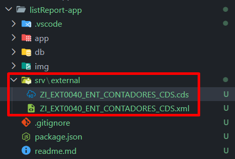
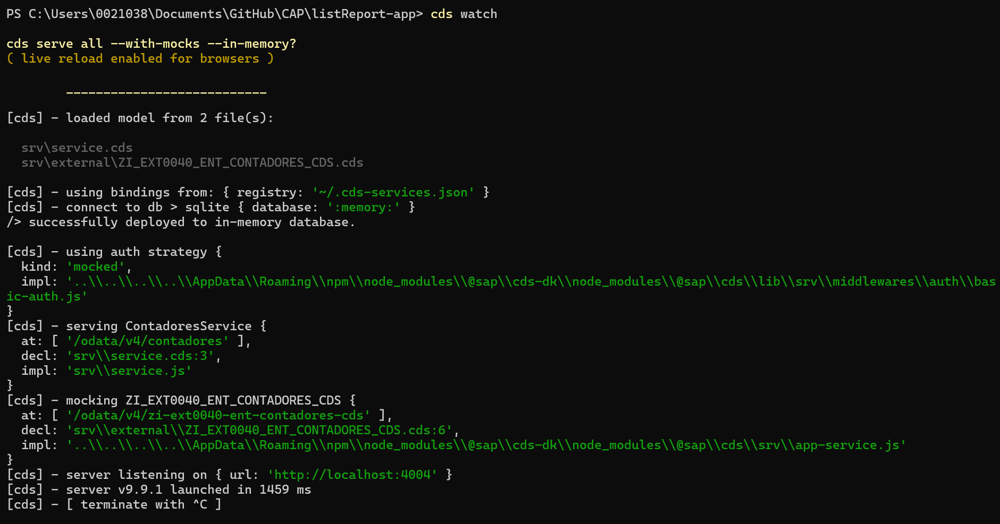
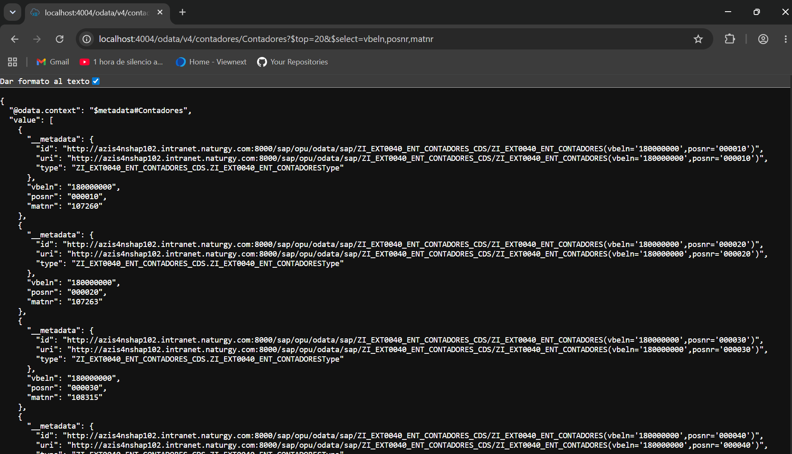
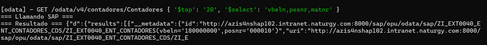

# Getting Started

Welcome to your new CAP project.

It contains these folders and files, following our recommended project layout:

File or Folder | Purpose
---------|----------
`app/` | content for UI frontends goes here
`db/` | your domain models and data go here
`srv/` | your service models and code go here
`readme.md` | this getting started guide

## Next Steps

- Open a new terminal and run `cds watch`
- (in VS Code simply choose _**Terminal** > Run Task > cds watch_)
- Start with your domain model, in a CDS file in `db/`

## Learn More

Learn more at <https://cap.cloud.sap>.


## 🗺️ CAP List Report — Hoja de Ruta


Paso | Nombre | Qué hacemos
--|-------|-------------
1 | Inicializar proyecto CAP | cds init + estructura de carpetas
2 | Generar modelo de datos | Script que lee XML y genera schema.cds
3 | Servicio OData | Exponer entidad con service.cds
4 | Crear fichero de conexión | fichero json con credenciales de acceso
5 | Arrancar y verificar OData | Probar endpoint en navegador
6 | Frontend — HTML+JS | Página con filtros y tabla
7 | Conectar frontend al OData |Fetch con filtros dinámicos
8 | Revisión y ajustes finales | Todo junto funcionando


## 1 Inicializar proyecto CAP

`cds init`

Crear estructura de carpetas del proyecto

`npm install axios`

Descarga e instala la librería `axios` en la carpeta `node_modules` del proyecto para poder hacer llamadas HTTP desde `service.js`

Sin ella, `require('axios')` falla.


## 2 Generar modelo de datos

`cds import C:\Users\0021038\Desktop\ZI_EXT0040_ENT_CONTADORES_CDS.xml --as cds`

Resultado: Modelo importado



## 3 Servicio OData - Exponer entidad con service.cds

`service.cds` le dice a CAP qué entidades expone y con qué forma — es el contrato del API.

Define:

* El nombre del servicio y su ruta (`/odata/v4/contadores`)
* Qué entidades son accesibles (`Contadores`)
* Qué operaciones se permiten (`@readonly`)
* Qué campos tiene cada entidad


Es como una vista ABAP — declara la estructura pero no la lógica. La lógica va en `service.js`.

[Service.cds](./srv/service.cds)

`service.js` es la lógica — lo que ocurre cuando alguien llama al API.
En nuestro caso: cuando alguien hace un GET a `/Contadores`, llama al SAP remoto con axios y devuelve los datos.
Es como un **método ABAP** — aquí sí ocurren cosas.

[Service.js](./srv/service.js)

## 4 Crear fichero de conexión

[default-env.json](./default-env.json)


## 5 Arrancar y verificar OData | Probar endpoint en navegador

`C:\Users\0021038\Documents\GitHub\CAP\listReport-app> cds watch`

Se inicia servidor local



``` js

http://localhost:4004/odata/v4/contadores/Contadores?$top=20&$select=vbeln,posnr,matnr´

```




Salida en el servidor local




## 6 Frontend — HTML+JS - Página con filtros y tabla