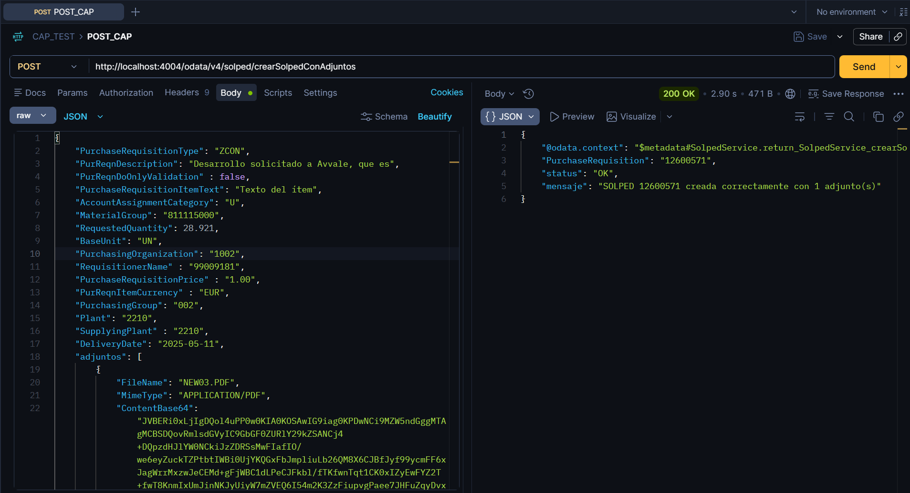

# Getting Started

Welcome to your new CAP project.

It contains these folders and files, following our recommended project layout:

File or Folder | Purpose
---------|----------
`app/` | content for UI frontends goes here
`db/` | your domain models and data go here
`srv/` | your service models and code go here
`readme.md` | this getting started guide

## Next Steps

- Open a new terminal and run `cds watch`
- (in VS Code simply choose _**Terminal** > Run Task > cds watch_)
- Start with your domain model, in a CDS file in `db/`

## Learn More

Learn more at <https://cap.cloud.sap>.

## Resumen de instrucciones ejecutadas

### Paso 01 - Prerequisitos

Verifica Node.js (recomendado v18 o v20 LTS)

>   `node --version`

Verifica npm

>   `npm --version`

Verifica SAP CDS CLI

>   `cds --version`

Verifica Cloud Foundry CLI (para despliegue en BTP)

`cf --version`

### Paso 02 - Crear el proyecto CAP

Esto creará una carpeta solped-app con la estructura base de CAP

>   `cds init solped-app`

Entrar en la carpeta del proyecto

>   `cd solped-app`

Instalar las dependencias base

>   `npm install`

Instalar `axios` para las llamadas HTTP a las APIs externas

>   `npm install axios`

Abrir el proyecto en Visual Studio Code

>   `code .`

### Paso 03 - Importar metadata APIs para definir el modelo de datos

📥 Importar metadata desde APIs externas

CAP tiene el comando cds import que permite generar automáticamente el modelo a partir de metadata de una API. CAP genera el `.cds` automáticamente en `srv/external/`.

API 1 - ME51N (crear SOLPED)

>   `cds import solped_create.xml --as cds`

[fichero solped_create.cds](./srv/external/solped_create.cds)

API 2 - Adjuntar ficheros

>   `cds import solped_attach.xml --as cds`

[fichero solped_attach.cds](./srv/external/solped_attach.cds)

### Paso 04 - Definir servicio

>   Creación manual de `srv/service.cds` con la acción crearSolpedConAdjuntos

Modelo de datos de servicio

[fichero service.cds](./srv/service.cds)

Lógica del servicio

[fichero service.js](./srv/service.js)

### Paso 05 - Implementar lógica

Creación manual de srv/service.js con:

Llamada HTTP a API1 (crear SOLPED)

Obtención del PurchaseRequisition

Llamada HTTP a API2 (adjuntar ficheros)

### Paso 06 - Configurar entorno

`npm install dotenv`  # luego descartado

Creación manuel en raíz de proyecto `default-env.json` con variables de entorno y configuración de package.json

    SAP_BASE_URL=http://azis4nshap102.intranet.naturgy.com:8000
    SAP_USER=tu_usuario
    SAP_PASS=tu_contraseña

Arranque y pruebas

>   `cds watch`

### Estado actual

Fichero | Estado
-----------------|--------
`srv/external/solped_create.cds` | ✅ Generado
`srv/external/solped_attach.cds` | ✅ Generado
`srv/service.cds` | ✅ Creado
`srv/service.js` | ✅ Creado
`default-env.json` | ✅ Creado
`package.json` | ✅ Configurado

### test desde POSTMAN

Crear proyecto en `POSTMAN` y probar

[fichero test body json](test_body.json)
